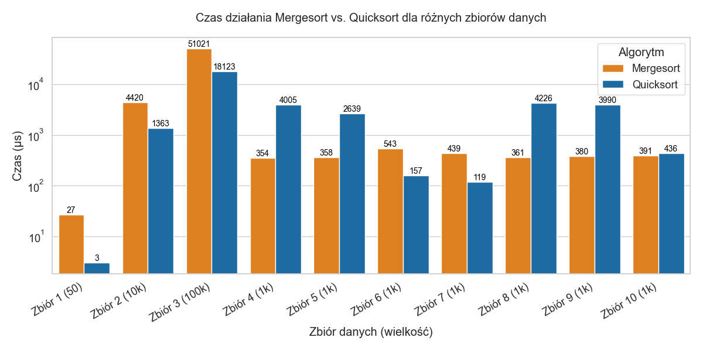

# Implementacja i porównanie czasu działania algorytmów sortujących `Mergesort` i `Quicksort`
**Autor:** *Zachariasz Jażdżewski*

# Opis projektu

Projekt polega na implementacji oraz porównaniu wydajności dwóch algorytmów sortujących - Merge Sort (sortowanie przez scalanie) oraz Quicksort (sortowanie szybkie) - na zbiorach liczb całkowitych. Program demonstracyjny `demo.cpp` pozwala użytkownikowi na:

- Wczytanie zbioru danych z pliku tekstowego i wykonanie obu sortowań
- Wygenerowanie losowego zbioru danych i zapisanie go do pliku

Pprogram mierzy czas działania każdego z algorytmów z użyciem biblioteki `chrono`, a następnie zapisuje wyniki oraz posortowany zbiór danych do pliku wyjściowego.

# Struktura projektu
```graphql
/
├── mergesort.cpp        # Implementacja funkcji mergeSort
├── quicksort.cpp        # Implementacja funkcji quickSort
├── demo.cpp             # Program demonstracyjny
├── report.md            # Kod źródłowy sprawozdania w języku markdown
├── report.pdf           # Sprawozdanie w formacie pdf
├── sets/                # Katalog dziesięciu zbiorów testowych
│   ├── set_01.txt
│   ├── set_02.txt
│   ├── ...
│   └── set_10.txt
└── outputs/             # Katalog plików wyjściowych
    ├── output_01.txt
    ├── output_02.txt
	├── ...
	└── output_10.txt 
```

Projekt nie wykorzystuje plików nagłówkowych. Wszystkie implementacje znajdują się w plikach `.cpp`. Aby umożliwić kompilatorowi dostęp do definicji algorytmów sortujących, pliki z algorytmami są bezpośrednio dołączone w `demo.cpp`.

# Sposób uruchomienia

1. **Kompilacja**
	```
	g++ demo.cpp mergesort.cpp quicksort.cpp -o demo
	```
2. **Uruchomienie**
	```
	./demo
	```

# Opis programu `demo.cpp`

Program udostępnia użytkownikowi prosty interfejs:
```
Choose mode:
1. Sort a dataset from a file
2. Generate random dataset and save to file
Enter choice (1 or 2):
```

### Tryb 1: Sortowanie

1. Program pyta o nazwę pliku wejściowego
	```
	Enter input file name: example_input.txt
	```
2. Wczytuje dane
3. Wykonuje oba sortowania (i mierzy ich czas)
4. Wyświetla czasy działania w terminalu
	```
	--- Sorting Completed ---
	Merge Sort Time: 321 microseconds
	Quick Sort Time: 123 microseconds
	```
5. Pyta o nazwę pliku wyjściowego
	```
	Enter output file name: example_output.txt
	```
6. Zapisuje w nim czas działania obu algorytmów oraz posortowane dane
	```
	Results written to "example_output.txt"
	```
	w takim formacie:
	```
	Merge Sort Time (microseconds): 321
	Quick Sort Time (microseconds): 123

	Sorted Data:
	1 2 3 ...
	```

### Tryb 2: Generowanie

1. Program pyta o nazwę pliku wyjściowego oraz o wielkość generowanego zbioru
	```
	Enter output file name for generated set: generated_example.txt
	Enter number of random integers to generate: 100
	```
2. Zapisuje losowo wygenerowane dane do wskazanego pliku

# Opis zestawów testowych

W katalogu `sets` znajduje się zestaw dziesięciu plików tekstowych zawierających testowe zbiory liczb do posortowania. Dane zostały przygotowane za pomocą skryptów w języku Python. Każdy zbiór ma swoją unikatową charakterystykę:

| Nazwa pliku  |                      Opis                           | Wielkość |
| ------------ | --------------------------------------------------- | -------- |
| `set_01.txt` | Mały zbiór w losowym porządku                       | 50       |
| `set_02.txt` | Duży zbiór w losowym porządku                       | 10000    |
| `set_03.txt` | Bardzo duży zbiór w losowym porządku                | 100000   |
| `set_04.txt` | Posortowany zbiór                                   | 1000     |
| `set_05.txt` | Posortowany odwrotnie zbiór                         | 1000     |
| `set_06.txt` | Prawie posortowany zbiór                            | 1000     |
| `set_07.txt` | Prawie posortowany odwrotnie zbiór                  | 1000     |
| `set_08.txt` | Posortowany zbiór z duplikatami                     | 1000     |
| `set_09.txt` | Wszystkie elementy takie same                       | 1000     |
| `set_10.txt` | Wielokrotne powtórzenie kilku unikatowych elementów | 1000     |

Dzięki temu możemy przetestować różne sytuacje, w tym optymistyczne lub pesymistyczne dla obu algorytmów (jak np. posortowany zbiór dla algorytmu quicksort)

# Metodologia

Każdy zestaw danych był testowany dla obu algorytmów, czas mierzony w mikrosekundach za pomocą biblioteki `chrono`, dzięki czemu możemy zobaczyć różnicę nawet przy tak małych zbiorach jak 50 elementów. Wyniki sortowań wraz z czasem działania obu algorytmów zostały zapisane do plików w katalogu `outputs`.

# Analiza wyników

### Podsumowanie wyników

Poniższa tabela przedstawia czas działania algorytmów MergeSort i QuickSort dla zbiorów testowych:

| Zbiór                       | Wielkość zbioru | Mergesort (μs) | Quicksort (μs) | Porównanie              |
| --------------------------- | --------------: | -------------: | -------------: | ----------------------- |
| **1** (mały, losowy)            | 50              | 27             | 3              | Quicksort `9×` szybszy    |
| **2** (duży, losowy)            | 10 000          | 4 420          | 1 363          | Quicksort `3.2×` szybszy  |
| **3** (wielki, losowy)          | 100 000         | 51 021         | 18 123         | Quicksort `2.8×` szybszy  |
| **4** (posortowany)             | 1 000           | 354            | 4 005          | Mergesort `11.3×` szybszy |
| **5** (odw. posortowany)        | 1 000           | 358            | 2 639          | Mergesort `7.4×` szybszy  |
| **6** (prawie posortowany)      | 1 000           | 543            | 157            | Quicksort `3.5×` szybszy  |
| **7** (prawie odw. posortowany) | 1 000           | 439            | 119            | Quicksort `3.7×` szybszy  |
| **8** (duplikaty)               | 1 000           | 361            | 4 226          | Mergesort `11.7×` szybszy |
| **9** (wszystkie identyczne)    | 1 000           | 380            | 3 990          | Mergesort `10.5×` szybszy |
| **10** (kilka unikatowych)      | 1 000           | 391            | 436            | Mergesort `1.1×` szybszy  |

### Wizualizacja



### Wnioski

1. **Dane losowe (zestawy 1 - 3)**
Quicksort jest znacznie szybszy niż mergesort w przypadku danych losowych. 
2. **Dane posortowane/odwrotnie posortowane (zestawy 4 i 5)**
Widać katastrofalny spadek wydajności quicksort w porównaniu do mergesort. Jest to scenariusz pesymistyczny, gdzie złożoność quicksort spada do `O(n²)`.
3. **Dane częściowo posortowane (zbiór 6 i 7)**
Zaskakująco quicksort radzi sobie świetnie w porównaniu do mergesort (`3.5×` szybciej)
4. **Dane z duplikatami (zbiory 8 - 10)**
Mergesort świetnie zachowuje swoją złożoność `O(n log n)` radzi sobie `10-12×` szybciej od quicksort

Po naszych wynikach widać, że mergesort jest mocno stabilny. Wykazuje się bardzo stabilną złożonością niezależnie od "udziwnień" w zbiorach danych. Quicksort radzi sobie zdecydowanie lepiej w bardziej realistycznych scenariuszach, gdzie dane są losowe i jest ich dużo.

Quicksort jest zatem szybszy w typowych scenariuszach, lecz ryzykowny dla przypadków skrajnych, mergesort zaś zapewnia przewidywalność i stabilność kosztem nieco wolniejszego działania.
